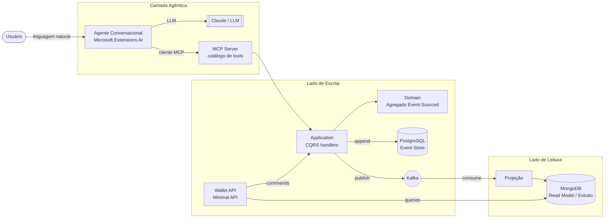

# FinAgent

Backend de carteira/ledger financeiro em **microsserviços**, operável e consultável por **linguagem natural** através de um **agente de IA**. Sistema *AI-first*: o agente é o produto, não um enfeite.

O núcleo financeiro é modelado com **Event Sourcing + CQRS + Arquitetura Hexagonal**; a camada agêntica expõe as capacidades do sistema como **tools de um MCP Server** e as orquestra com um **agente conversacional**.

## Arquitetura



## Stack

| Camada | Tecnologia |
|---|---|
| Linguagem / runtime | C# 14 / .NET 10 (LTS, `net10.0`) |
| Event Store (escrita) | PostgreSQL (append-only, concorrência otimista) |
| Read Model (leitura) | MongoDB |
| Mensageria | Apache Kafka |
| Camada agêntica | MCP C# SDK + Microsoft.Extensions.AI |
| Testes | xUnit v3 + AwesomeAssertions + Testcontainers |
| Infra local | Docker Compose |
| CI/CD | GitHub Actions (+ Azure DevOps na v3) |

> Versões **fixadas** pela [ADR-0009](docs/adr/0009-stack-e-versoes.md) — não altere aqui sem alterar o ADR.

## Estrutura

```
src/
  FinAgent.Wallet.Domain          # núcleo Event-Sourced (sem dependências)
  FinAgent.Wallet.Application     # casos de uso / CQRS (define as portas)
  FinAgent.Wallet.Infrastructure  # adapters: Postgres, Mongo, Kafka
  FinAgent.Wallet.Api             # entrada REST (Minimal API)
  FinAgent.Ai.McpServer           # MCP Server — catálogo de tools
  FinAgent.Ai.Agent               # agente conversacional (cliente MCP + LLM)
tests/
  FinAgent.Wallet.UnitTests       # regras de negócio, sem banco
  FinAgent.Wallet.IntegrationTests# event store real via Testcontainers
docs/adr/                         # Architecture Decision Records
```

## Decisões de arquitetura

Todas registradas em [`docs/adr/`](docs/adr/):

- [ADR-0001](docs/adr/0001-event-sourcing-no-ledger.md) — Event Sourcing no ledger
- [ADR-0002](docs/adr/0002-cqrs.md) — CQRS
- [ADR-0003](docs/adr/0003-arquitetura-hexagonal.md) — Arquitetura Hexagonal
- [ADR-0004](docs/adr/0004-kafka-mensageria.md) — Kafka
- [ADR-0005](docs/adr/0005-mongodb-read-model.md) — MongoDB no read model
- [ADR-0006](docs/adr/0006-camada-agentica-mcp.md) — Camada agêntica via MCP
- [ADR-0007](docs/adr/0007-postgres-event-store.md) — PostgreSQL como Event Store
- [ADR-0008](docs/adr/0008-partida-dobrada-no-ledger.md) — Partida dobrada no ledger
- [ADR-0009](docs/adr/0009-stack-e-versoes.md) — Stack e versões de plataforma
- [ADR-0010](docs/adr/0010-linguagem-visual.md) — Linguagem visual do frontend

## Rodando a infra local

```bash
docker compose up -d      # sobe Postgres, MongoDB e Kafka
```

## Roadmap

- **v1** — serviço Wallet (ES+CQRS+Hexagonal) + testes + CI + MCP Server + agente consultando saldo/extrato.
- **v2** — segundo microsserviço + eventos via Kafka + agente de ingestão de documentos (NF-e/XML).
- **v3** — deploy em cloud + pipeline Azure DevOps + observabilidade (OpenTelemetry).

## Status

🚧 Em construção — fundação (ADRs + estrutura) definida; serviços em desenvolvimento.
