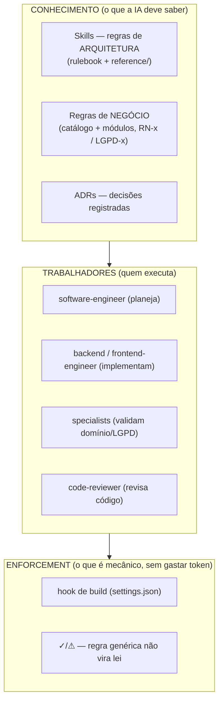
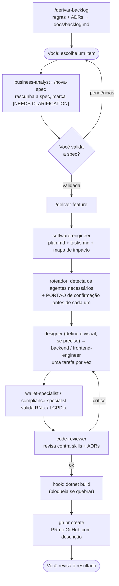
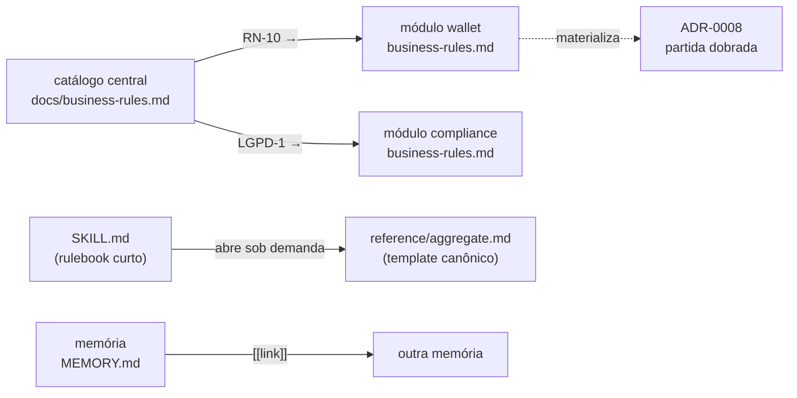

# Arquitetura do Harness — FinAgent

> Como o time de IA dentro de `.claude/` transforma uma ideia em código revisado e com PR.
> Escrito em dois níveis: **simples** (o modelo mental) e **de engenheiro** (a mecânica).

---

## 1. TL;DR (o modelo mental)

O "harness" é o **andaime que guia a IA** para trabalhar do seu jeito, de forma repetível.
Não é o produto — é a cozinha padronizada que produz o produto. Você entra em **2 pontos**:
descrever a ideia e validar a spec. O resto é automático:

```
regras → /derivar-backlog → ideia → /nova-spec → você valida → /deliver-feature → planeja →
implementa → revisa → build → PR
```

Ele se organiza em **dois eixos independentes** (papel e módulo) e economiza token com um
**grafo de navegação** (você carrega só o nó exato que precisa, quando precisa).

---

## 1.1 Stack e versões (o que o harness produz)

Fixado pela **ADR-0009**. A versão está declarada em três lugares, de propósito — o harness
só funciona se o agente não puder "não saber" qual é:

| Onde | O que carrega | Quando o agente vê |
|------|---------------|--------------------|
| `CLAUDE.md` | tabela completa de versões | SEMPRE (constituição, sempre em contexto) |
| `SKILL.md` de cada skill | bloco "Stack fixada" no topo | ao carregar a skill da tarefa |
| `docs/adr/0009-stack-e-versoes.md` | decisão, trade-offs e alternativas | quando precisa do PORQUÊ |

```
Backend   .NET 10 (LTS, net10.0) · C# 14 · OpenAPI nativo (sem Swashbuckle)
Testes    xUnit v3 · AwesomeAssertions · Testcontainers
Frontend  Angular 22 (LTS) · Vitest · Signal Forms · httpResource (leitura)
```

Suporte: .NET 10 até 11/2028, Angular 22 até 05/2028 — nenhuma migração forçada no
horizonte do projeto.

---

## 2. Os dois eixos

O harness não é uma lista de agentes — é uma **matriz** de duas dimensões que crescem
separadamente.

| Eixo | O que é | Componentes |
|------|---------|-------------|
| **Papel** (como trabalhar) | quem planeja/implementa/revisa — vale para todo módulo | `business-analyst`, `software-engineer`, `designer`, `backend-engineer`, `frontend-engineer`, `code-reviewer` + skills |
| **Módulo** (o domínio) | as regras de negócio de cada área | `docs/modules/<mod>/business-rules.md` + agente `<mod>-specialist` |

**Por que separar:** um papel novo (ex.: um `qa-engineer`) serve todos os módulos; um
módulo novo (ex.: `cartao`) reusa todos os papéis. Cada eixo escala sem tocar o outro.

---

## 3. As camadas (o que existe em `.claude/` e `docs/`)



- **Skills** = "o código está bem-feito?" (hexagonal, event sourcing/CQRS, testes, Angular).
- **Regras de negócio** = "o dinheiro/domínio está certo?" (RN-x do wallet, LGPD-x).
- **ADRs** = por que as decisões de arquitetura foram tomadas. ADR é **restrição, não fonte
  de trabalho**: nenhum item de backlog nasce de um ADR estrutural — ele entra citado na
  seção 7 (Restrições herdadas) de cada spec. A fonte de capacidade são as regras de negócio.
- **Enforcement** = travas determinísticas (build automático; ✓ é lei, ⚠ é sugestão).

---

## 4. O fluxo ponta a ponta



**Regra de ouro do fluxo:** uma tarefa por vez; nunca avança com ambiguidade; você AUTORIZA
cada chamada de agente (portão de confirmação); o `designer` vem antes do frontend quando o
visual é novo/indefinido; item "crítico" volta ao engenheiro e revisa de novo; PR só com build
verde e zero críticos.

---

## 5. O grafo (a parte que economiza token)

Este é o coração da sua pergunta. O harness é, por dentro, um **grafo de conhecimento
navegável**: os **nós** são pedaços de conhecimento e os **arcos** são referências por
**ID/caminho**. A IA **navega** até o nó exato em vez de carregar tudo.



### Por que isso gasta pouco token — os 2 mecanismos

**1. Progressive disclosure (divulgação progressiva).**
Cada skill tem dois níveis: o `SKILL.md` (rulebook curto, ~40 linhas) fica sempre visível;
os `reference/*.md` (templates de 150 linhas) **só são lidos quando a IA vai escrever
aquilo**. Descobrir uma skill custa ~80 tokens; o conteúdo pesado só entra quando é usado.

```
Nível 1: nome + descrição da skill      (sempre no contexto — barato)
Nível 2: SKILL.md (invariantes, tabela)  (carrega quando a skill dispara)
Nível 3: reference/*.md (código canônico) (carrega só na hora de escrever aquele artefato)
```

**2. Navegação por ID em vez de despejo.**
As regras não são coladas inteiras no contexto. A IA lê o **catálogo** (índice), acha o
**ID** relevante (`RN-10`, `LGPD-1`) e só então **abre** o arquivo do módulo daquele ID.
É o padrão *"Don't Retrieve, Navigate"*: em vez de recuperar tudo e filtrar, você caminha
pelo grafo até o nó certo.

> **A sacada:** o "grafo que economiza token" no seu harness **não é um índice de código**
> (tree-sitter/AST) — isso só valeria com um codebase grande, e o Grep/Glob já cobre. É o
> **grafo de regras e templates**: nós = skills, regras, ADRs, memórias; arcos = referências
> por ID/caminho/`[[link]]`. Navegar nele carrega o mínimo necessário.

---

## 6. As três camadas de regra (e o mecanismo ✓/⚠)

Regra não é tudo igual. O harness separa três tipos, cada um no seu lugar:

| Tipo | Pergunta que responde | Onde mora |
|------|-----------------------|-----------|
| **Arquitetura** | o código está bem-feito? | `.claude/skills/` |
| **Negócio** (RN-x) | o dinheiro/domínio está certo? | `docs/modules/wallet/` |
| **Compliance** (LGPD-x) | o dado pessoal está protegido? | `docs/modules/compliance/` |

Cada regra de negócio tem uma **origem**:
- **✓ Confirmada** — consta em ADR/CLAUDE.md → **é lei** (violar = crítico).
- **⚠ Confirmar** — princípio importado de fora → **é sugestão**, não trava o projeto.

Isso impede que uma regra genérica da internet **invalide seu modelo**. O especialista só
bloqueia por regra ✓.

---

## 7. Enforcement e eficiência

O que os melhores harnesses fazem, e você tem:

- **Hook determinístico** (`.claude/hooks/verify-build.ps1` + `settings.json`): ao fim de
  cada turno, roda `dotnet build`; se quebrar, **bloqueia e devolve o erro ao modelo**.
  Erro pego mecanicamente = **sem gastar uma rodada de LLM** = menos token + mais precisão.
- **Tiering de modelo**: Opus no planejamento (decisão real); Sonnet na implementação;
  **Haiku** nos specialists (validar por ID é mecânico).
- **Anti-over-orquestração**: cada subagente é um contexto novo = token. Só aciona
  especialista quando a feature toca aquele domínio.

---

## 8. O que um engenheiro deve saber (resumo cru)

1. **Dois eixos ortogonais:** papel (cross-módulo) × módulo (domínio). Crescem separados.
2. **Plan-then-execute:** o `software-engineer` planeja uma vez; os engenheiros executam
   copiando **templates canônicos** (não re-derivam estrutura → menos erro, menos token).
3. **Progressive disclosure:** rulebook sempre; `reference/` sob demanda. É o principal
   lever de token.
4. **Grafo de navegação por ID:** catálogo → módulo → `RN-x`/`LGPD-x`; skill → `reference/`;
   memória via `[[link]]`. Navega até o nó, não despeja o grafo.
5. **Três camadas de regra** (arquitetura/negócio/compliance) + **✓/⚠** para o genérico não
   virar lei.
6. **Verificação adversarial em duas passadas:** specialist (domínio) antes do code-reviewer
   (código). Crítico volta e revisa de novo.
7. **Enforcement determinístico** (hook de build) tira do LLM o que a máquina resolve.
8. **Fronteira humana:** você só decide a spec e aprova o resultado.

---

## 9. Mapa de arquivos

```
.claude/
  skills/        # regras de arquitetura (rulebook + reference/) — progressive disclosure
  agents/        # papéis + specialists de módulo
  hooks/         # verify-build.ps1 (enforcement)
  settings.json  # hook de build registrado
docs/
  adr/                     # decisões de arquitetura (0001..0010; 0009 = stack, 0010 = linguagem visual)
  business-rules.md        # CATÁLOGO central de regras (índice do grafo — FONTE das capacidades)
  backlog.md               # candidatos derivados das regras (gerado por /derivar-backlog)
  modules/
    README.md              # registro de módulos + como clonar
    wallet/business-rules.md      # RN-1..RN-12 (domínio)
    compliance/business-rules.md  # LGPD-1..9 (transversal)
  specs/TEMPLATE.md        # formato de spec (seção 7 = Restrições herdadas, por ID)
  harness-architecture.md  # este documento
```

---

## 10. O eixo do visual (design)

Terceira perna do frontend, ao lado de arquitetura e convenções. Mesmo mecanismo do resto do
harness (rulebook + `reference/` sob demanda, decisão gravada como lei ✓):

- **Skill `frontend-design`** — a linguagem visual: invariantes anti-"cara de IA", a heurística
  contexto→direção, e o `reference/catalog.md` (índice de direções — HOJE VAZIO, a popular com
  fontes SEM copyright). Consumida pelo `designer` e pelo `frontend-engineer`.
- **Comando `/definir-design`** (skill `definir-design`) — explora o catálogo, gera **2 direções
  em 2 links** para o usuário ver, e ao escolher **grava** em `docs/adr/0010-linguagem-visual.md`
  + `src/styles/tokens.css` (fonte única de tokens).
- **Regra ✓/⚠:** enquanto a ADR-0010 é "Proposto", o `frontend-engineer` PARA antes de inventar
  visual — a direção precisa ser escolhida primeiro. Escolhida, vira lei ✓ e toda tela lê os tokens.

O "grava a escolha" é o ADR + tokens; os "2 links pra olhar" são os previews. Curadoria do
catálogo (fontes sem copyright → destilar princípios/tokens, nunca clonar markup) é o passo
pendente antes do primeiro `/definir-design`.

---

*Fluxo de entrada:* `/derivar-backlog` → escolhe o item → `/nova-spec "<ideia>"` → valida →
`/deliver-feature docs/specs/<slug>/spec.md`.
*Fluxo do visual:* `/definir-design` → 2 previews em 2 links → você escolhe → grava ADR-0010 + `src/styles/tokens.css`.
